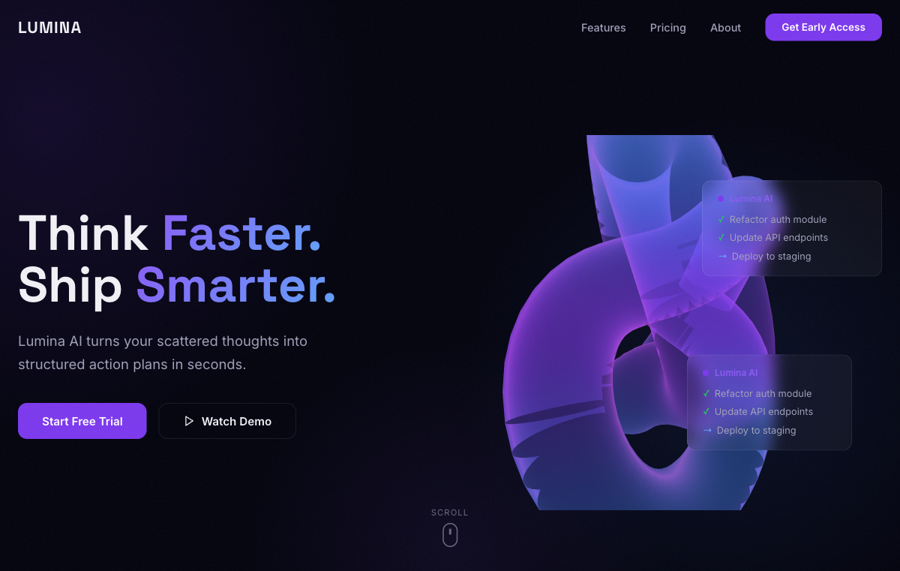
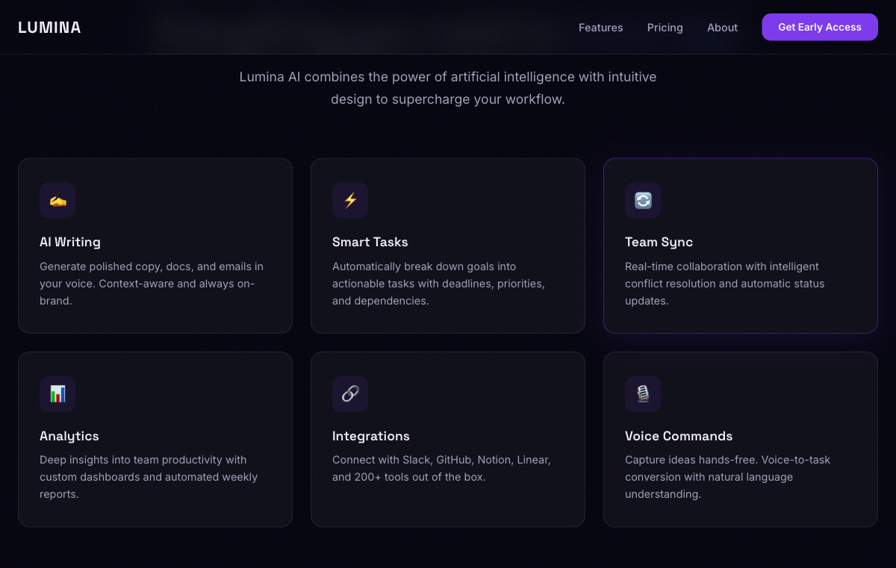
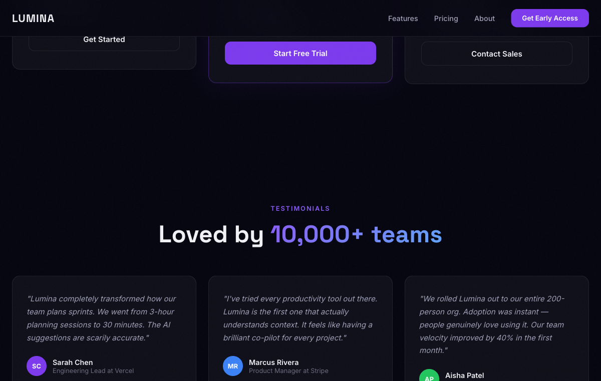

# 🌟 Lumina

> **Immersive SaaS landing page — animated 3D visuals and scroll-driven storytelling to showcase your product.**

[](https://lumina-beta-one.vercel.app)

---

## ✨ Features

- 🌌 **Interactive 3D hero** — Three.js scene rendered via React Three Fiber with real-time camera interaction and post-processing
- 📜 **Scroll-driven animations** — GSAP ScrollTrigger pins sections and animates elements as the user scrolls through the page
- ✨ **Framer Motion transitions** — smooth page-level and component-level animations with spring physics
- 🎨 **Polished design sections** — Hero, Features, Showcase, Pricing, and Footer — all production-ready
- 📸 **Screenshot gallery** — visual proof-of-concept sections with real product shots
- 📱 **Fully responsive** — layout adapts gracefully from mobile to widescreen
- 🚀 **Vite + TypeScript** — lightning-fast dev experience with full type safety

---

## 🖼️ Screenshots

| Hero | Features | Pricing |
|---|---|---|
|  |  |  |

---

## 🛠️ Tech Stack


---

## 🚀 Local Setup

### Prerequisites

- Node.js 18+

### 1. Clone the repo

```bash
git clone https://github.com/pratham7711/lumina.git
cd lumina
npm install
```

> **Note:** This project references a local `@pratham/ui` package at `../pratham-ui`. If you don't have that sibling directory, remove or stub out the import — the rest of the page will work independently.

### 2. Run the dev server

```bash
npm run dev
```

Open [http://localhost:5173](http://localhost:5173)

---

## 🏗️ Build for Production

```bash
npm run build     # TypeScript compile + Vite bundle → dist/
npm run preview   # Preview the production build locally
```

Deploy the `dist/` folder to Vercel, Netlify, or any static host.

---

## 📁 Project Structure

```
src/
├── components/
│   ├── Hero/          # Three.js 3D scene + hero copy
│   ├── Features/      # Animated feature cards
│   ├── Showcase/      # Screenshot / product visual section
│   ├── Pricing/       # Pricing table
│   └── Footer/        # Links, socials
├── hooks/             # useScrollAnimation, useThreeScene
├── utils/             # GSAP helpers, Three.js setup
└── App.tsx
```

---

## 📄 License

MIT — free to use, modify, and distribute.

---

<p align="center">Built by <a href="https://github.com/pratham7711">Pratham</a> · Powered by Three.js + GSAP + Framer Motion</p>
